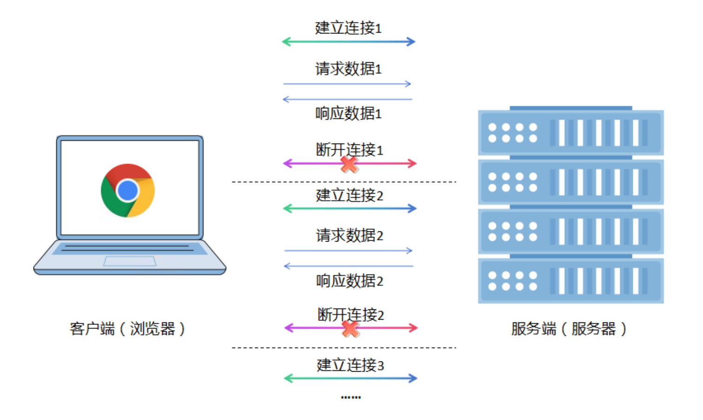

1.1.1 HTTP/1.x状态机与报文结构
===

# 一、HTTP协议基础与演进

## 1.1 HTTP在Web通信中的核心角色

HTTP（超文本传输协议）是Web应用的基石，位于TCP/IP协议栈的应用层。它定义了客户端（通常是浏览器）与服务器之间的通信格式和规则。从渗透测试角度看，理解HTTP意味着掌握了与目标系统对话的语言。

**关键特性：**

**无状态协议：** 每个请求独立，服务器不保留之前请求的信息

**基于请求-响应模型：** 客户端发起请求，服务器返回响应

**明文传输（通常）：** HTTP/1.x默认不加密，可直接观察通信内容

>**渗透测试关联：** 无状态特性催生了Cookie/Session等身份维护机制，这些正是会话管理漏洞的源头。

## 1.2 版本演进简史

HTTP/0.9（1991年）：仅支持GET方法，响应只返回HTML

HTTP/1.0（1996年）：正式RFC文档，增加了POST、HEAD方法，引入状态码、头部字段

HTTP/1.1（1997年，主流）：默认持久连接、强制Host头部、管线化、分块传输等

>**安全视角：** 老旧的HTTP/0.9或1.0服务器可能缺乏现代安全机制，是信息收集中的重要发现。

# 二、连接管理：HTTP状态机解析

## 2.1 短连接 vs 长连接

**HTTP/1.0 - 短连接模型：**

>客户端：建立TCP连接 → 发送请求 → 接收响应 → 关闭连接
>（每次请求重复此过程）

缺点：高延迟，服务器资源消耗大。

**HTTP/1.1 - 长连接（Keep-Alive）：**

>客户端：建立TCP连接 → 请求1 → 响应1 → 请求2 → 响应2 → ... → 关闭连接

通过Connection: keep-alive头部启用长连接模式（HTTP/1.1默认）。

>渗透测试意义：长连接中多个请求共享同一TCP连接，可能影响会话劫持测试的边界判断。

## 2.2 管线化（Pipelining）

允许客户端在收到前一个响应前发送多个请求，但服务器必须按请求顺序返回响应。由于实现复杂和队头阻塞问题，实际使用有限。

>安全测试角度：非常规的管线化请求可能触发服务器异常处理，用于模糊测试。